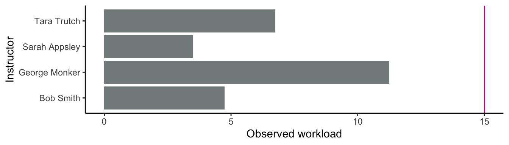

<!-- README.md is generated from README.Rmd. Please edit that file -->

# assignteachr

<!-- badges: start -->
<!-- badges: end -->

The goal of `assignteachr` is to calculate and visualize instructor
workload for the purposes of creating yearly teaching instructor
assignments. This package was built with the goal of doing this for the
UBC MDS program.

## Installation

You can install the development version of assignteachr from
[GitHub](https://github.com/) with:

``` r
# install.packages("devtools")
devtools::install_github("UBC-MDS/assignteachr")
```

## Example usage

Load the `assignteachr` package, and any other packages you need (e.g.,
`tidyverse`):

``` r
library(assignteachr)
library(tidyverse)
#> ── Attaching core tidyverse packages ──────────────────────── tidyverse 2.0.0 ──
#> ✔ dplyr     1.1.2     ✔ readr     2.1.4
#> ✔ forcats   1.0.0     ✔ stringr   1.5.0
#> ✔ ggplot2   3.4.3     ✔ tibble    3.2.1
#> ✔ lubridate 1.9.2     ✔ tidyr     1.3.0
#> ✔ purrr     1.0.2     
#> ── Conflicts ────────────────────────────────────────── tidyverse_conflicts() ──
#> ✖ dplyr::filter() masks stats::filter()
#> ✖ dplyr::lag()    masks stats::lag()
#> ℹ Use the conflicted package (<http://conflicted.r-lib.org/>) to force all conflicts to become errors
```

Load your course data:

``` r
mds_courses <- read_csv("data/mds_courses.csv")
mds_courses
```

    #> # A tibble: 3 × 4
    #>   course_code course_number credits academic_units
    #>   <chr>               <dbl>   <dbl> <chr>         
    #> 1 DSCI                  511     0.5 MDS           
    #> 2 DSCI                  521     0.5 MDS           
    #> 3 DSCI                  100     3   STAT

Load your section data:

``` r
mds_sections <- read_csv("data/mds_sections.csv")
mds_sections
```

    #> # A tibble: 8 × 8
    #>   course_code course_number section_number enrollment session
    #>   <chr>               <dbl> <chr>               <dbl> <chr>  
    #> 1 DSCI                  511 001                   100 W1     
    #> 2 DSCI                  511 L01                   100 W1     
    #> 3 DSCI                  511 L02                   100 W1     
    #> 4 DSCI                  521 001                   100 W1     
    #> 5 DSCI                  521 L01                   100 W1     
    #> 6 DSCI                  521 L02                   100 W1     
    #> 7 DSCI                  100 001                   100 W2     
    #> 8 DSCI                  100 002                   100 W2     
    #> # ℹ 3 more variables: first_time_multiplier <lgl>,
    #> #   redevelopment_multiplier <lgl>, instructor <chr>

Load your instructor data:

``` r
mds_instructors <- read_csv("data/mds_instructors.csv")
mds_instructors
```

    #> # A tibble: 4 × 7
    #>   name          position  workload_credits prop_teaching prop_other_work prop_el
    #>   <chr>         <chr>                <dbl>         <dbl>           <dbl>   <dbl>
    #> 1 Bob Smith     Lecturer                15           0.9             0       0.1
    #> 2 Sarah Appsley TLF                     15           0.9             0       0.1
    #> 3 George Monker Lecturer                15           0.7             0.2     0.1
    #> 4 Tara Trutch   Tenure-t…               15           0.8             0.2     0  
    #> # ℹ 1 more variable: capstone_groups <dbl>

Calculate the workload for each instructor:

``` r
mds_workload <- calculate_workload(mds_courses,
                                   mds_sections,
                                   mds_instructors)
#> Joining with `by = join_by(course_code, course_number)`
mds_workload
#> # A tibble: 4 × 7
#>   instructor   workload_credits observed_workload obs_exp_diff    W1    W2     S
#>   <chr>                   <dbl>             <dbl>        <dbl> <int> <int> <dbl>
#> 1 Bob Smith                  15              4.75       -10.2      1     0  2.25
#> 2 George Monk…               15             11.2         -3.75     1     1  2.25
#> 3 Sarah Appsl…               15              3.5        -11.5      1     0  1.5 
#> 4 Tara Trutch                15              6.75        -8.25     0     1  0.75
```

View the workload for each instructor as a bar chart, as well as their
expected workload:

``` r
view_workload(mds_workload)
```



View the balance of each instructor’s teaching credits across semesters:

``` r
view_teaching_balance(mds_workload)
```


